# 🏫 UniSpace - classroom management system

**UniSpace** is a university project that represents a system for managing and reserving faculty classrooms through web and mobile applications. The system allows users to browse available classrooms, create reservations, and manage schedules, while administrators oversee users, classrooms and reservations.

## 📑 Content
- Web application
- Mobile application

## 🛠️ Web application

 - Login - admin authentication

   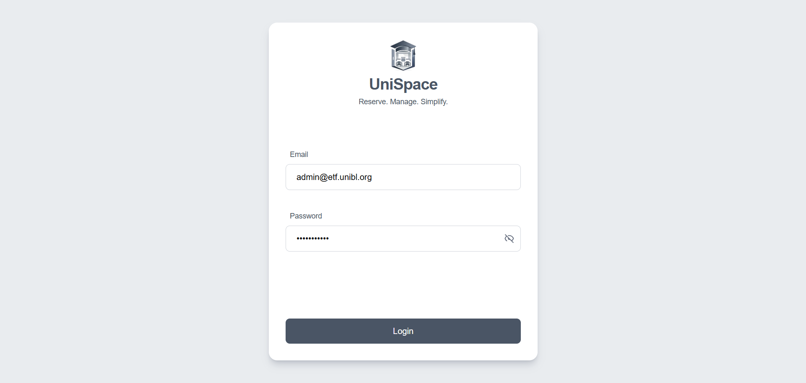

 - Manage users - view, search, add, edit and delete users

   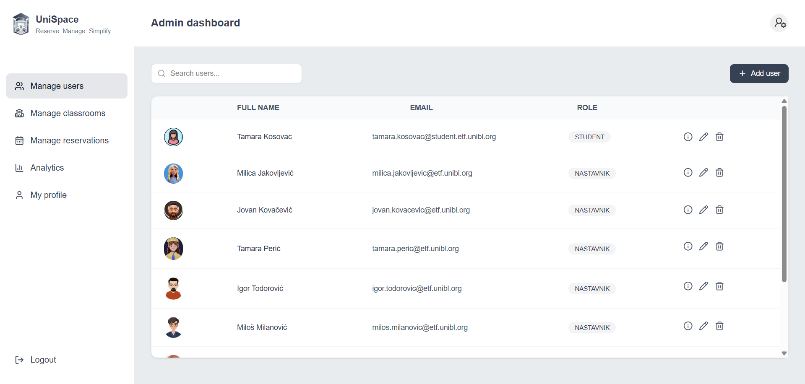

 - Manage classrooms - view, search, add, edit and delete classrooms

   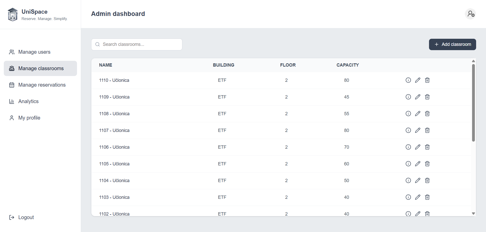

 - Manage reservations - create, view and manage classroom reservations

   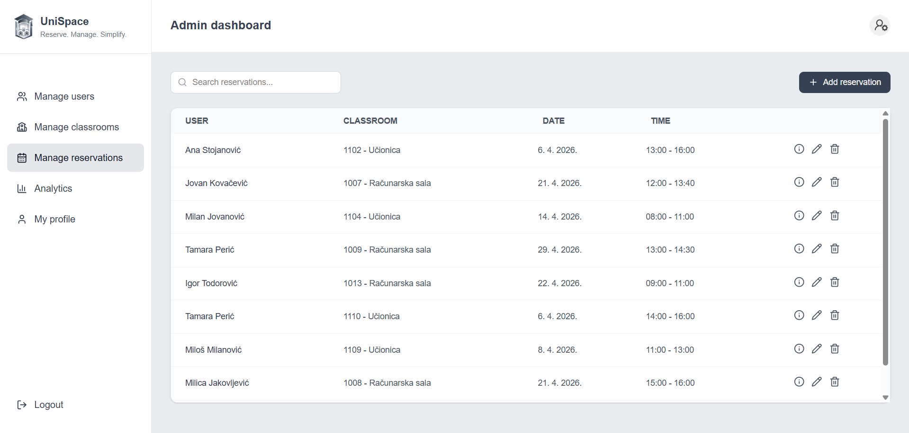

   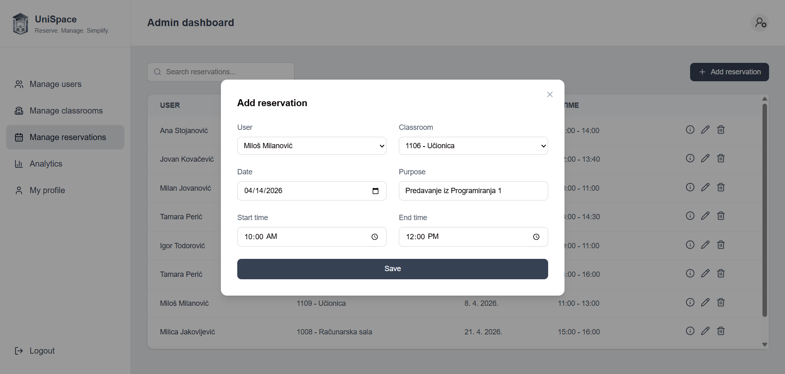

   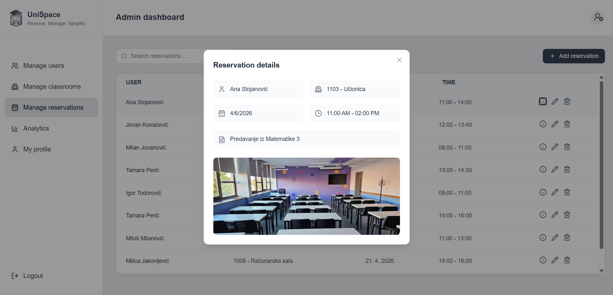

 - Analytics - view reservation statistics and system data

   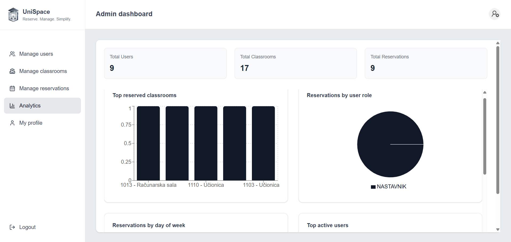

 - Admin profile - update profile information and password

   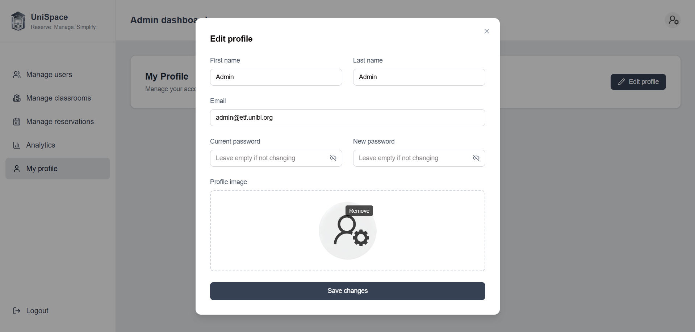

## 👥 Mobile application

 - Register and login - students can register and login, while teachers can only login

  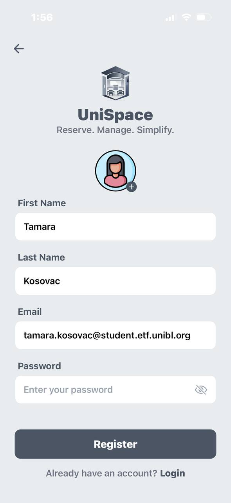
  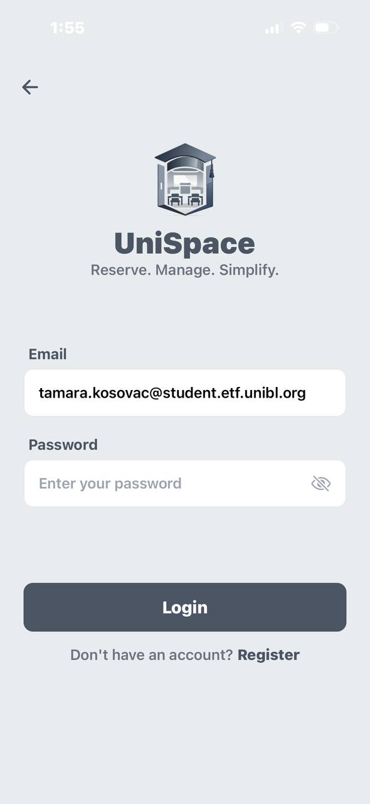

 - Classrooms - browse, search and filter classrooms by floor and availability for students and teachers

  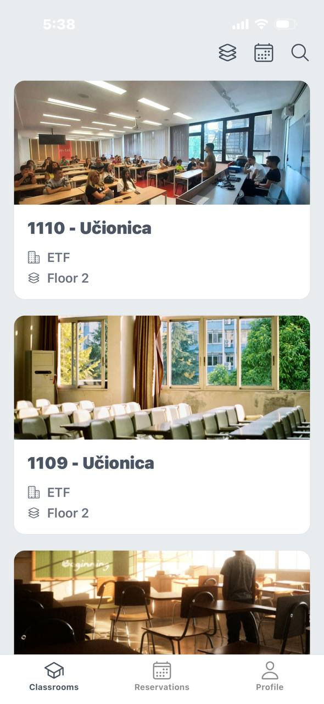
  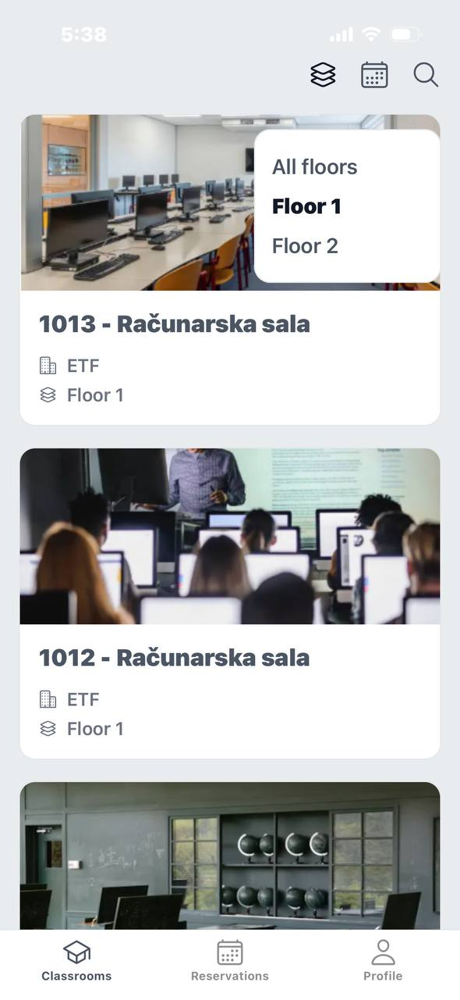

 - Reservations - view, search and filter reservations for students and teachers, while only teachers can create, update and delete their reservations

  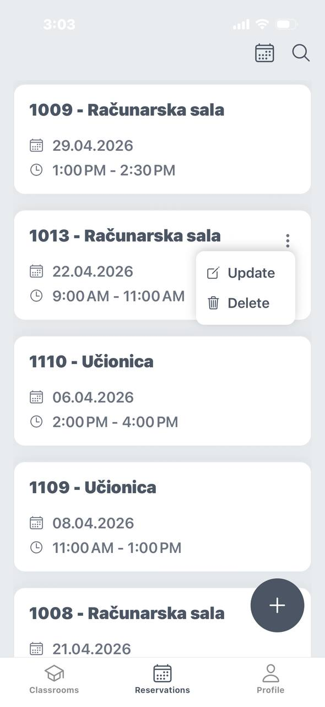
  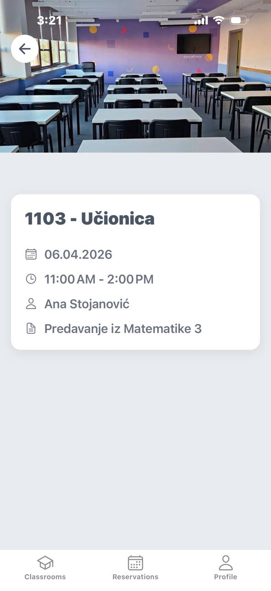

  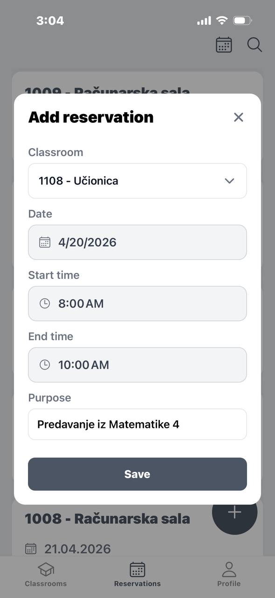
  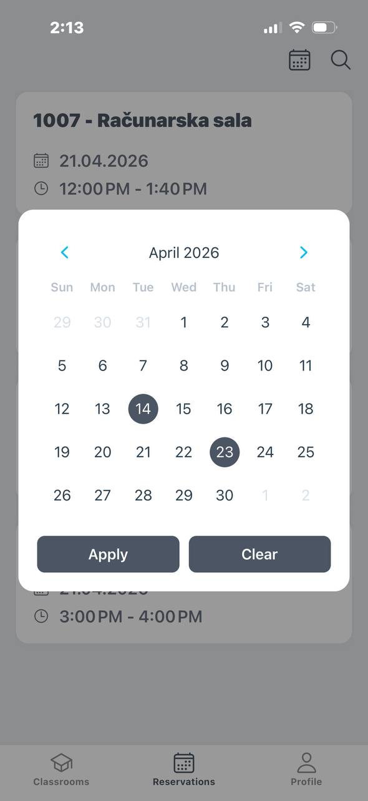

 - Profile - view and edit profile information

  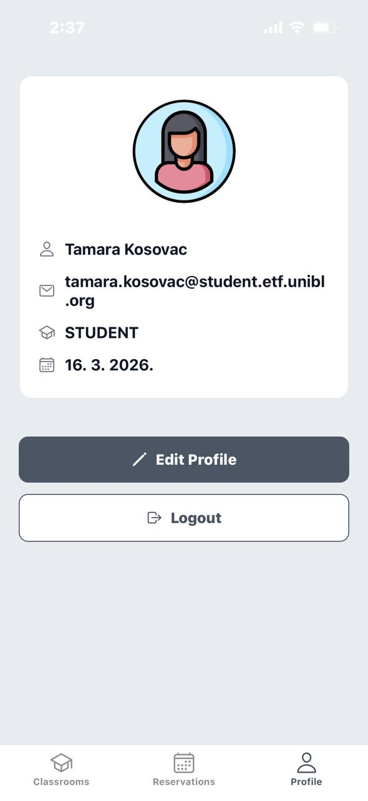
  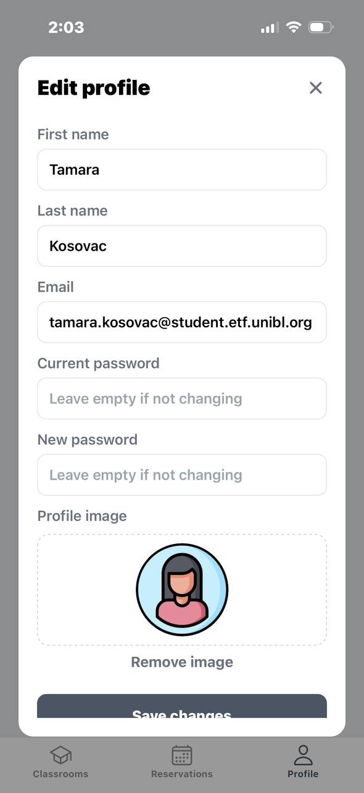

